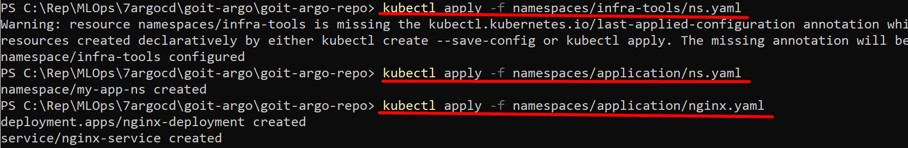
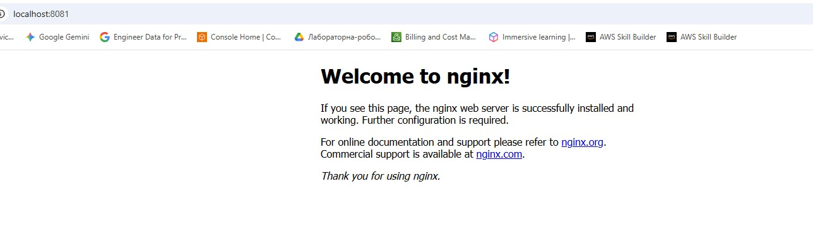
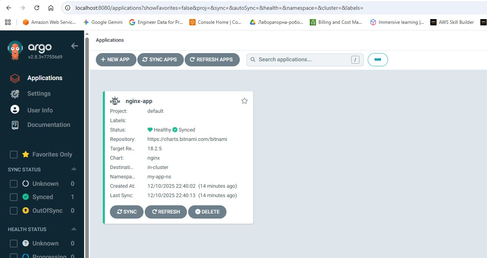

Цей репозиторій містить GitOps конфігурацію для розгортання застосунку через ArgoCD.

## Структура
- `namespaces/infra-tools/ns.yaml`: Неймспейс для інфраструктурних інструментів.
- `namespaces/application/ns.yaml`: Цільовий неймспейс для застосунку.
- `namespaces/application/nginx.yaml`: Маніфест ArgoCD Application 

## Як запустити

1. **Попередні умови**: Кластер EKS запущено, ArgoCD встановлено в `infra-tools`.

2. **Застосування конфігурації**:
   Виконайте команду, щоб ArgoCD почав слідкувати за застосунком:

  ```bash
   kubectl apply -f namespaces/infra-tools/ns.yaml
   kubectl apply -f namespaces/application/ns.yaml

  ```
  

  ```bash
   kubectl apply -f namespaces/application/nginx.yaml
   ```
     
## Перевірка

1. Перевірити поди:
  ```bash
  kubectl get pods -n my-app-ns
  ```
  

2. Доступ до застосунку:
 ```bash
  kubectl port-forward svc/nginx-app -n my-app-ns 8081:80
  ```
  Відкрийте в браузері: http://localhost:8081

  

3. Доступ до ArgoCD UI:
 ```bash
  kubectl port-forward svc/argocd-server -n infra-tools 8080:443
  ```

https://localhost:8080


